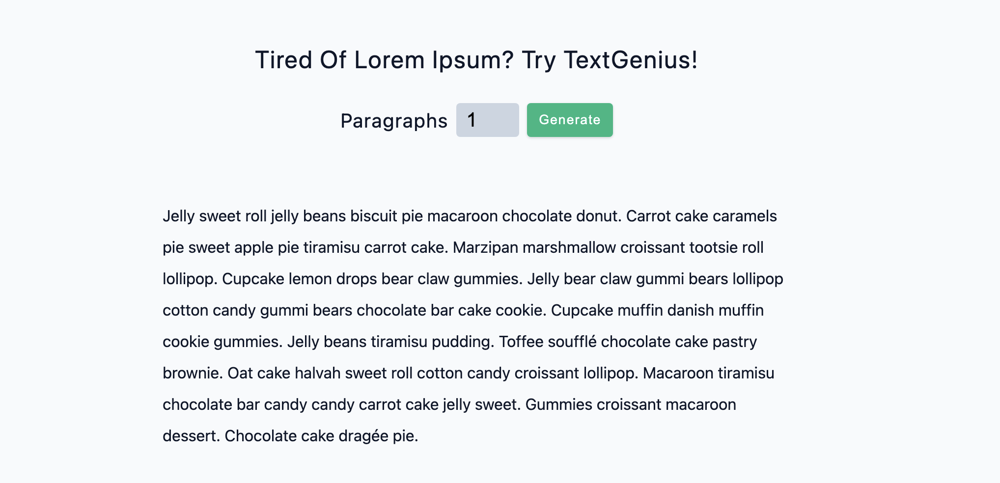

## TextGenius

The `TextGenius` React app aims to generate paragraphs of placeholder text based on user input. It involves setting up a count state value using the `useState` hook, creating a `form` with a number input and a submit button, and importing a text array. When the user submits the form, the app extracts the first `n` paragraphs from the text array (where n is the count value) and displays them below the form. The paragraphs are rendered with unique IDs generated using the `nanoid` library.

### Tech Stack
- `JavaScript`: The foundational programming language for creating responsive and interactive features.
- `React`: The powerful JavaScript library used to build the project: 
- - `useState`: The React hook used to manage state.
- `nanoid`: The library used for generating unique IDs, enhancing data handling and management within the project.
### Explore The Website
[TextGenius on Netlify](https://text-genius.netlify.app/)

### Preview

